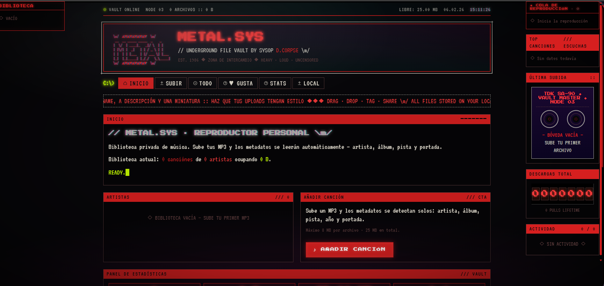

# CHANGELOG — METAL.SYS

Historial completo de cambios. Orden cronológico descendente (más reciente arriba).
Cada sesión debe añadir su entrada al inicio de este archivo.

---

## 2026-06-05 — Migración B2 → Cloudflare R2

**Autor:** Claude (claude-sonnet-4-6) por instrucción del usuario  
**Archivos modificados:** `api/audio.js`, `api/files.js`

### Cambios
- **`api/audio.js`**: Reescrito para generar URLs presignadas contra R2 en vez de B2.
  - Implementa AWS Signature V4 manualmente (sin dependencias npm).
  - Bucket: `metalsys`, Endpoint: `97bd5e1fe0734dd2a333126bb65abbf8.r2.cloudflarestorage.com`, Región: `auto`.
  - Variables de entorno: `R2_ACCESS_KEY_ID` / `R2_SECRET_ACCESS_KEY` (se eliminan `B2_KEY_ID` / `B2_APP_KEY`).
- **`api/files.js`**: Migrado de B2 API propietaria a S3 API de R2 (ListObjectsV2 + GetObject firmados).
  - También extrae `TPOS` (número de disco) del ID3.
  - El campo `b2Path` se mantiene por compatibilidad con `app.jsx`.

---

## 2026-06-05 — 9 correcciones y mejoras (sesión 2)

**Autor:** Claude (claude-sonnet-4-6) por instrucción del usuario  
**Archivos modificados:** `app.jsx`, `crt.css`

### Correcciones de bugs
1. **TopSongs** (sidebar derecho): ahora incluye `localFiles` en el ranking — antes ignoraba la carpeta local
2. **Shuffle**: al activar aleatorio, la cola empieza en la canción actual y baraja el resto; ya no mezcla incluyendo la actual en posición aleatoria
3. **Carpeta local**: al recargar la página, si el permiso del sistema no está activo, el handle se limpia — ya no aparece como "conectada" sin estarlo

### Mejoras de UI
4. **Stats → Favoritos → Artista**: muestra la foto del artista (meta o portada de disco) en lugar del icono de nota; cambiado a icono de persona si no hay foto
5. **Stats → Favoritos → Artista**: icono genérico cambiado de nota musical a silueta de persona
6. **Cola de reproducción** (sidebar): número de posición ahora tiene `min-width: 24px` — ya no se solapa con el nombre al llegar a 3 dígitos
7. **Nav**: orden nuevo — INICIO, STATS, SUBIR, **TODO** (nueva), LOCAL, ME GUSTA, **BANDAS** (antes TODO)
8. **Inicio → biblioteca actual**: "ocupando" suma vault + local; añadido "(En local X canciones, Xgb)" si hay carpeta conectada
9. **StatusBar**: "(LOCAL X)" → "(Local X canciones, Xgb)" con tamaño real
10. **BANDAS** (antes TODO): icono de artista sin portada cambiado de nota a silueta de persona; muestra imagen de artistMeta si existe
11. **TODO** (nueva página): lista todas las canciones de vault + local ordenadas alfabéticamente

---

## 2026-06-05 — 27 mejoras y correcciones

**Autor:** Claude (claude-sonnet-4-6) por instrucción del usuario  
**Archivos modificados:** `app.jsx`, `crt.css`, `.gitignore` (nuevo)

### Cambios visuales / UI
1. **AlbumCard**: la animación de hover ahora afecta a todo el contenedor (lift + glow), no solo al vinilo
2. **AlbumCard**: corregido desbordamiento de texto/título al hover — `minWidth: 0` en el wrapper
3. **AlbumCard**: botón ▶ movido a la esquina inferior derecha de la portada, rojo, solo visible en hover
4. **CategoryPage**: eliminado botón "VOLVER" redundante del header de artista
5. **Nav**: reordenado — INICIO, STATS, SUBIR, LOCAL, TODO, ME GUSTA
6. **Nav**: nuevos iconos — corazón (ME GUSTA), gráfico de barras (STATS), carpeta (LOCAL), nota musical (TODO)
7. **UploadPage**: icono de nota musical en dropzone sustituido por `IconGlyph iconId="nota"`
8. **DetailPage**: eliminado cassette (redundante con el reproductor inferior)
9. **StatusBar**: "VAULT ONLINE" → "SYSTEM ONLINE", "NODE 03" → "NODE 01", "ARCHIVOS" → "CANCIONES", eliminado "LIBRE: X MB"
10. **Banner**: autor cambiado a "Yeremias", fecha actualizada a 27/06/2026, géneros actualizados
11. **Footer**: badges eliminados; añadidos iconos de enlace a GitHub, Discord, Steam, Spotify; copyright actualizado
12. **Inicio**: eliminado `StatsPanel` (redundante con el tree)
13. **Inicio**: eliminada sección "AÑADIDAS RECIENTEMENTE"
14. **Inicio**: artistas limitados a 12 con botón expandir/colapsar
15. **Inicio**: botón ♪ AÑADIR CANCIÓN con icono alineado verticalmente
16. **Inicio**: bloque LOCAL con más texto y botón DESCONECTAR

### Nuevas funcionalidades
17. **MusicPlayer**: barra de progreso ahora soporta arrastrar (drag) además de click
18. **CategoryPage**: botón ✎ EDITAR ARTISTA con modal para imagen y descripción; se persiste en `metalsys_artist_meta_v1`; imagen usada en tarjetas de INICIO y TODO
19. **LocalPage**: añadido botón ✕ DESCONECTAR que limpia estado y handle de IndexedDB
20. **Sidebar derecho**: NowStreaming y PlayQueue fusionadas en `PlayQueueWithNowPlaying` — cassette arriba, cola abajo
21. **Sidebar derecho**: `DownloadCounter` reemplazado por `PlaysCounter` (suma de `playCounts`)
22. **Sidebar derecho**: `RecentActivity` rediseñado como log estilo `tail -f` — 10 líneas, scroll, timestamps, eventos de música (PLAY, PAUSE, NEXT, PREV, LIKE, UNLIKE, UP, DL, DEL)
23. **Sidebar izquierdo**: botones ▶ de lib-tree invierten colores al hover (fondo rojo, triángulo oscuro)
24. **Inicio → ARTISTAS**: `songCount` ahora incluye archivos locales
25. **Vinilo**: brillo rojo radial detrás del disco en hover

### Técnico
26. **`.gitignore`**: creado para excluir `.claude/`, `node_modules/`, etc.
27. **Comentarios en español**: añadidos en las secciones principales de `app.jsx`

---

## 2026-06-02 — 11 mejoras implementadas

**Autor:** Claude (claude-sonnet-4-6) por instrucción del usuario  
**Archivos modificados:** `app.jsx` (+~730 líneas), `crt.css` (+~280 líneas)

### Nuevas funcionalidades

#### 1. Árbol de biblioteca (sidebar izquierdo)
- Nuevo componente `LibraryTree` en columna izquierda del grid
- Muestra artistas > discos > canciones, colapsables por nivel
- Click en nombre navega a la página del artista/disco
- Botón ▶ en cada artista y disco para reproducir directamente
- Se oculta automáticamente en pantallas < 1050px

#### 2. Cola de reproducción (sidebar derecho)
- Nuevo componente `PlayQueue` en sidebar derecho
- Muestra la pista actual destacada y el orden de reproducción
- Drag-to-reorder: arrastra canciones para reordenar con HTML5 drag API
- Tiempo real: se actualiza cuando cambia el contexto o el modo shuffle
- `manualQueue` state: permite sobrescribir la cola derivada con un orden manual
- Al cambiar contexto (artista/disco/todo), el orden manual se descarta

#### 3. Top canciones (sidebar derecho)
- Nuevo componente `TopSongs` en sidebar derecho
- Muestra las 10 canciones más reproducidas con contador
- `playCounts` state persistido en `metalsys_playcounts_v1` (localStorage)
- Se incrementa al iniciar cada pista nueva en `startTrack`

#### 4. Botón Me Gusta + página ME GUSTA
- `LikeButton` component (♡/♥ toggle)
- Visible en: barra del reproductor, DetailPage (acciones)
- `likedIds` state (Set) persistido en `metalsys_likes_v1`
- Nueva página `MESGUSTA` accesible desde la nav (♥ GUSTA)
- Botón "▶ REPRODUCIR ME GUSTA" en la página
- `MeGustaPage` muestra grid de canciones liked con botón para quitar

#### 5. Subpágina de estadísticas
- Nueva ruta `{ page: 'STATS' }`, botón STATS en nav
- `StatsPage` component con:
  - Grid de 8 métricas: canciones, artistas, reproducciones, me gusta, subidas, descargas, borradas, tamaño medio
  - Fecha de la primera subida + canción más escuchada
  - Timeline de subidas por día (gráfico de barras verticales)
  - Top 5 artistas por reproducciones (barras horizontales)
  - Panel de uso de vault (reutiliza StatsPanel)

#### 6. Menú ··· en el reproductor
- Botón `···` en la barra del reproductor (MusicPlayer)
- `PlayerMenuDropdown` component: dropdown con opciones ◆ CREAR MARCADOR y ✂ CREAR CLIP
- Se cierra al hacer click fuera (mousedown listener)

#### 7. Marcadores
- `BookmarkModal`: formulario nombre + tiempo (M:SS) con valor pre-rellenado al tiempo actual
- `bookmarks` state `{ [fileId]: [{id, name, time}] }` persistido en `metalsys_bookmarks_v1`
- Pestaña MARCADORES en DetailPage: lista con botón ▶ (ir al marcador) y ✕ (borrar)
- `seekToBookmark(time)` llama a `seek()`

#### 8. Clips con reproducción en bucle
- `ClipModal`: formulario nombre + inicio + fin (M:SS)
- `clipStore` state `{ [fileId]: [{id, name, start, end}] }` persistido en `metalsys_clips_v1`
- Pestaña CLIPS en DetailPage: lista con botón ▶ (activar clip) y ✕ (borrar)
- `activeClip` state: `{ id, start, end }` — cuando activo, el handler `onTime` hace loop entre start y end
- `activeClipRef` sincronizado con state para que el closure de `onTime` siempre tenga el valor fresco
- El clip activo se resalta con clase `active-clip` (borde verde)

#### 9. Importar carpeta local de música
- Nueva ruta `{ page: 'LOCAL' }`, botón LOCAL en nav
- `LocalPage` component usa File System Access API (`showDirectoryPicker`)
- Escanea recursivamente directorios buscando .mp3/.wav/.ogg/.flac/.m4a/.aac/.opus/.aiff/.wma
- Muestra archivos encontrados antes de importar
- Importa con el mismo flujo que la subida normal (FileReader + ID3 parsing)
- Categoría asignada: `LOCAL` (si no hay artista en ID3)
- Límites normales aplicados: 8 MB/archivo, 25 MB total
- Solo funciona en Chrome/Edge (File System Access API)

#### 10. Forma de onda (waveform) en barra de progreso
- Al iniciar cada pista, decodifica el audio con `OfflineAudioContext.decodeAudioData`
- Genera array de 300 puntos RMS (amplitud media por bloque)
- SVG superpuesto en `.mp-bar` con dos polylines simétricas (parte alta y baja)
- `waveforms` state cache: `{ [fileId]: Float32Array }` — se computa una sola vez por pista
- Opacity 0.55 para no interferir con la barra de progreso

#### 11. Destello CRT sincronizado con la música
- `useEffect` con `requestAnimationFrame` que lee el RMS del `AnalyserNode` en tiempo real
- Modifica `opacity` del elemento `.crt-audio-pulse` (overlay radial blanco) en cada frame
- `audioSyncRef` para limpiar el RAF al detener/pausar
- Se activa solo cuando `isPlaying === true` y hay analyser disponible

### Cambios de layout
- `.grid` cambia de 2 columnas a 3: `220px 1fr 280px` (responsive: oculta sidebar izquierdo < 1050px, oculta derecho < 900px)
- Nuevo `lib-tree-wrap` con `position: sticky` para que el árbol siga el scroll
- `PlayQueue` + `TopSongs` + widgets existentes en columna derecha

### Nuevas claves de localStorage
| Clave | Contenido |
|---|---|
| `metalsys_likes_v1` | Array de IDs de canciones con me gusta |
| `metalsys_playcounts_v1` | Objeto `{ fileId: count }` |
| `metalsys_bookmarks_v1` | Objeto `{ fileId: [{id, name, time}] }` |
| `metalsys_clips_v1` | Objeto `{ fileId: [{id, name, start, end}] }` |

---

## 2026-06-02 — Refactor completo de documentación

**Autor:** Claude (claude-sonnet-4-6) por instrucción del usuario  
**Archivos modificados:** `README.md`, `Documentación/*` (todos reescritos desde cero)

- Documentación previa (generada por GitHub Copilot) descartada por ser genérica e inexacta
- Creados: CONTEXT.md, CHANGELOG.md, ARCHITECTURE.md, FUNCTIONS.md, FEATURES.md, PLAYBACK.md, UPLOAD.md, DEVELOPMENT.md, COMMANDS.md
- Actualizado README.md raíz

---

## Sesiones anteriores — Sistema de reproducción completo

*(sin fecha exacta, reconstruido desde el código)*

- `MusicPlayer` barra persistente con VU meter 60 barras
- `playContext` con tipos `all | artist | album`
- Shuffle (Fisher-Yates), Repeat (`off | all | one`)
- `TodoPage`, botones ▶ en artista/álbum

---

## Sesiones anteriores — Página de artista y búsqueda

*(sin fecha exacta, reconstruido desde el código)*

- Parser ID3v2 nativo, artista = categoría
- `CategoryPage` con cuadrícula de álbumes, buscador con sugerencias en vivo
- Thumbnails con canvas (paleta fósforo CRT)

---

## Sesiones anteriores — Base inicial

*(sin fecha exacta, reconstruido desde el código)*

- Base React CDN + Babel + JSX en navegador
- Sistema de subida con FileReader + progreso
- Estética CRT completa, TweaksPanel
- Visualizadores: imagen, vídeo, PDF, Markdown, texto, ZIP
- Multi-select, bulk download ZIP, bulk delete
